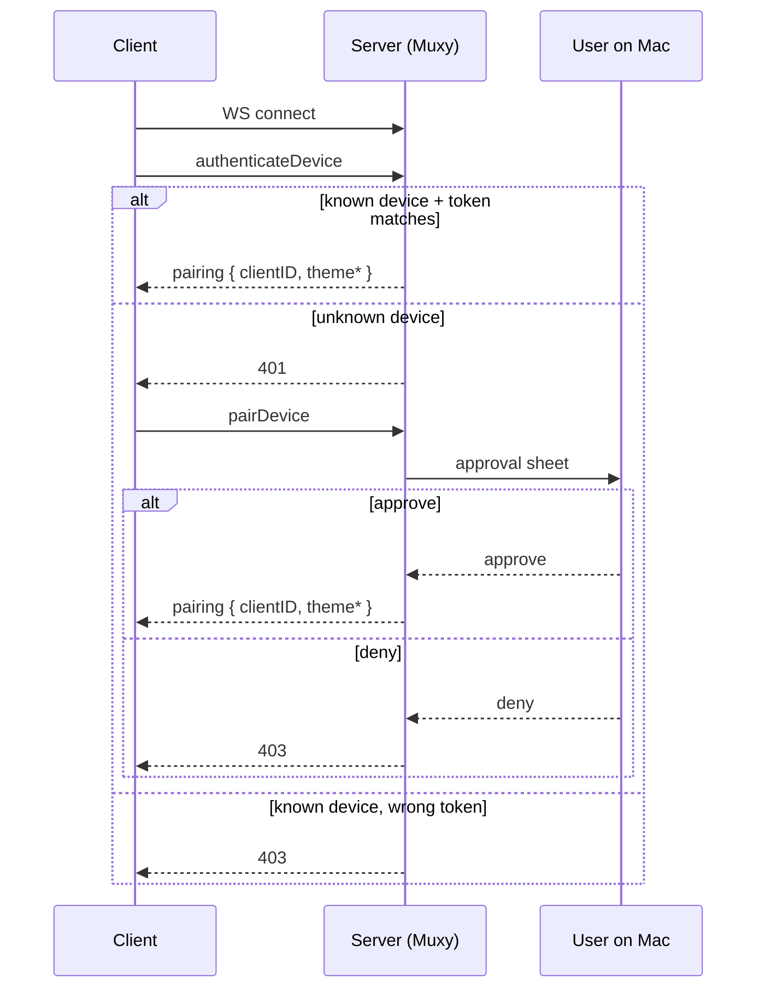

# Pairing & Authentication

Each client should generate and persist:

- `deviceID` — a stable UUID for that install
- `deviceName` — a user-friendly label
- `token` — a random secret persisted securely on the client

The desktop stores approved mobile clients in `approved-devices.json`, keeping only a SHA-256 hash of each token (never the token itself) plus the device name and last-seen time.

## Connection flow



Until authentication succeeds, every other RPC returns `401 Authentication required`.

## `authenticateDevice`

Authenticates a previously approved device.

```json
{
  "type": "authenticateDevice",
  "value": {
    "deviceID": "2f8d1f9f-e065-4f62-af30-8c4b3d0bfc53",
    "deviceName": "Pixel 9",
    "token": "random-secret-token",
    "theme": null
  }
}
```

`theme` is an optional [`clientTheme`](data-objects.md#client-theme). When present, the colors are stored for this connection and applied to every pane the client takes over (see [`setClientTheme`](methods.md)). It is the client→server counterpart to the `theme*` fields the server returns below, and may be omitted entirely. `pairDevice` accepts the same optional field.

Outcomes:

| Condition | Response |
| --- | --- |
| Device known and token matches | `pairing` result (authenticated) |
| Device **not** known | `401` — fall back to `pairDevice` |
| Device known but token does **not** match | `403` |

A matching authentication also updates the stored device name (if the client changed it) and refreshes its last-seen time.

Success result (`result.type` is `pairing`):

```json
{
  "type": "pairing",
  "value": {
    "clientID": "62ea9d06-a1f4-4a11-9f39-33ee322f6573",
    "deviceName": "Pixel 9",
    "themeFg": 16777215,
    "themeBg": 197379,
    "themePalette": [0, 16711680, 65280]
  }
}
```

`themeFg`, `themeBg`, and `themePalette` are optional and may be omitted. The `clientID` identifies this connection for the lifetime of the socket; it is not the `deviceID`.

## `pairDevice`

Same request shape as `authenticateDevice`. Triggers the approval sheet on the Mac for a device that is **not** already approved, and returns the same `pairing` result on approval. If the `deviceID` is already approved, `pairDevice` returns `403` — use `authenticateDevice` for known devices.

| Condition | Response |
| --- | --- |
| User approves | `pairing` result (authenticated) |
| User denies, or device already approved | `403` |

## `registerDevice`

Relabels the current connection's device name and returns the current theme. It is **not** a pre-auth entry point: like every method other than `authenticateDevice` and `pairDevice`, it requires an already-authenticated client and returns `401` otherwise. Authentication itself happens through `authenticateDevice` / `pairDevice`, which already register the device name on approval — so most clients never need to call this.

```json
{
  "type": "registerDevice",
  "value": { "deviceName": "Pixel 9" }
}
```

It returns a `deviceInfo` result with the same fields as `pairing` (`clientID`, `deviceName`, optional theme). It updates the connection's display name (used for pane-ownership labels) and re-fetches the theme; it does not change the authentication state.

## Token mismatch

A token mismatch on a **known** device returns `403 Pairing denied`, not `401`, so a stolen-but-outdated credential can't silently fall back to re-pairing. An **unknown** `deviceID` returns `401`. Re-pair from the client (`pairDevice`) to recover.

## Revocation

The Mac's **Settings -> Mobile** lists approved devices. Revoking removes the device from `approved-devices.json` and immediately disconnects any active connection for that `deviceID`.
