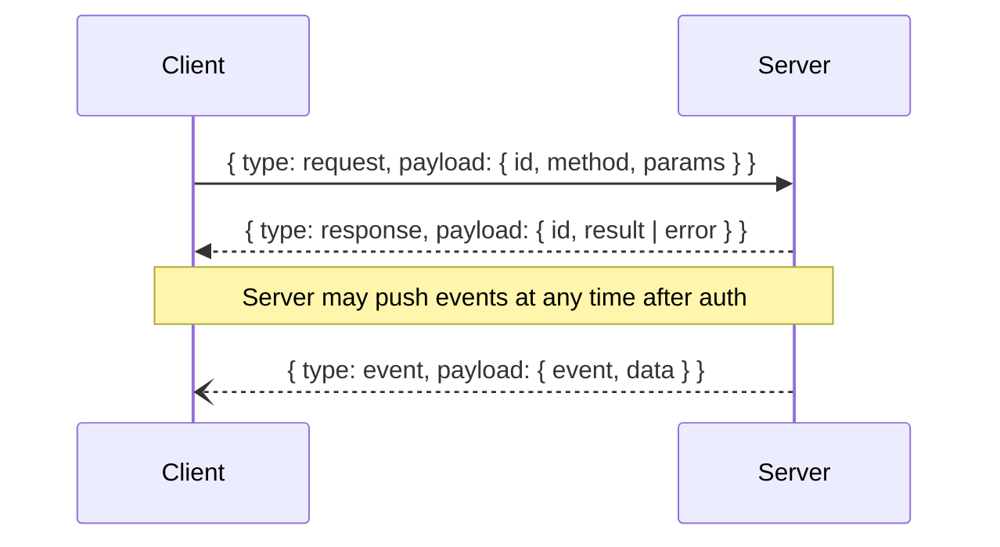

# Protocol

Every WebSocket frame is a JSON object with a top-level `type` field and a `payload`. Three types: `request`, `response`, `event`.



## Request envelope

```json
{
  "type": "request",
  "payload": {
    "id": "request-id",
    "method": "listProjects",
    "params": null
  }
}
```

Rules:

- `id` is unique per in-flight request and is echoed back on the response.
- `method` identifies the API operation.
- When `params` is present, `params.type` **must** equal `method`; a mismatch returns `400`.
- Methods without parameters may send `params: null`.
- Every request gets exactly one response **except `terminalInput`**, which is fire-and-forget and produces no response.

Example with params:

```json
{
  "type": "request",
  "payload": {
    "id": "req-1",
    "method": "getWorkspace",
    "params": {
      "type": "getWorkspace",
      "value": {
        "projectID": "9b84c9a0-1d55-4c64-bbf6-ef59ee02fa09"
      }
    }
  }
}
```

## Response envelope

Success:

```json
{
  "type": "response",
  "payload": {
    "id": "request-id",
    "result": { "type": "ok" }
  }
}
```

Failure:

```json
{
  "type": "response",
  "payload": {
    "id": "request-id",
    "error": { "code": 401, "message": "Authentication required" }
  }
}
```

Exactly one of `result` or `error` is present; the unused field is omitted. `result.type` names the payload (`projects`, `workspace`, `ok`, …) as listed per method in [Methods](methods.md).

## Event envelope

```json
{
  "type": "event",
  "payload": {
    "event": "workspaceChanged",
    "data": {
      "type": "workspace",
      "value": {
        "projectID": "…",
        "worktreeID": "…",
        "focusedAreaID": "…",
        "root": { "type": "tabArea", "tabArea": { "…": "…" } }
      }
    }
  }
}
```

`event` is the event name; `data.type` is the payload discriminator. The two often differ — e.g. `notificationReceived` carries `data.type` `notification`, `projectsChanged` carries `projects`, and `themeChanged` carries `deviceTheme`. See [Events](events.md) for the full mapping.
